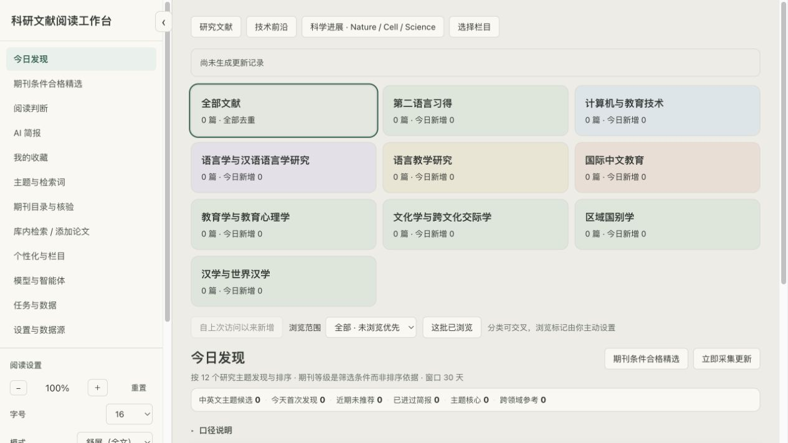

# Daily-Paper-Assistant

可配置、多语的本地科研文献阅读工作台。先按研究方向发现论文，再筛选、翻译、收藏与分析；无需注册账号，数据保存在自己的电脑上。



## 功能

- 九个预设研究栏目（由于本人是语言学、应用语言学方向的），可以重命名、新增及调整主题归属。首页显示、每日检索、本次检索分别设置。
- 首页提供研究文献、技术前沿、科学进展三个入口。
- 研究文献默认每日推荐最多50篇，技术前沿3篇，科学进展5篇；不足时显示实际数量。
- 标题、关键词和摘要完整展示。支持页面缩放、字号、行距、字体、宽度、配色、原文译文布局和命名阅读方案。
- 不同功能可以使用不同的 OpenAI 兼容模型连接，包括本地兼容服务。
- 自建智能体并按顺序组成流程；后一环节可以读取前一环节结果。提供任务进度、取消、重试和调用上限。
- 支持多语翻译、原文语种纠正、目标语种选择，原文始终保留。
- 期刊目录支持 CSV、TSV、Excel `.xlsx` 和粘贴表格，先匹配字段、预览再导入。
- 支持 JSON 迁移包与收藏 RIS／BibTeX 导出。

## 启动

1. 安装 Node.js 22 或更新版本，并确认具有 `node:sqlite`。建议使用 Node 官方当前 LTS：https://nodejs.org/。
2. 下载并解压项目；不要把项目解压在临时目录。
3. Mac 双击 `启动工作台.command`；Windows 双击 `启动工作台.cmd`。
4. 首次启动会通过 npm 安装 Excel 导入依赖，然后打开 `http://127.0.0.1:8787`。

也可在项目目录执行：

```sh
npm ci --ignore-scripts
npm start
```

启动器会检查环境及端口。已有本工作台运行时打开原页面；其他程序占用端口时提示更换端口，不终止其他程序。关闭启动终端会停止本次启动的服务。自动更新只在服务运行时执行，电脑关机时不会唤醒电脑；下次启动检查是否需要补做。更新程序文件不会覆盖用户数据。

可通过 `LITDESK_PORT` 更换端口，通过 `LITDESK_DATA_DIR` 指定数据位置。

## 第一次配置

进入“个性化与栏目”，设置工作台名称、感兴趣的方向及每日检索开关。新增的四个研究栏目默认展示，但不默认检索。点击“选择范围后检索”，核对研究方向、来源及最近多少天，再确认执行。

没有模型密钥时仍可发现、浏览和收藏论文，不会伪造 AI 输出。进入“模型与智能体”建立连接，填写接口基础地址、模型名称和 API Key，再测试连接。基础地址应为厂商要求的地址，例如 `https://api.deepseek.com` 或本地兼容服务的 `http://127.0.0.1:11434/v1`，程序追加 `/chat/completions`。仅支持兼容接口，不能直接使用厂商的不兼容协议。

可为翻译、速览及深入解读分别分配连接。新增智能体默认手动；选择自动触发后，进入阅读页面会产生模型调用。顺序流程中选择智能体并加入列表，使用上移／下移调整顺序。失败时保留已完成结果并停止下游，任务页可重试。模型与智能体设置不执行任意脚本。

## 数据源与证据

研究发现使用 Crossref、OpenAlex 及已配置的中文公开目录。技术前沿包含 ERIC、arXiv、已同步的 ACL 和 IEEE；IEEE 需用户自己的有效接口密钥，没有密钥不发请求。ACL 首次同步下载较大，需通过设置页明确触发。

CSSCI、中文核心、SSCI、JCR、中科院分区分别保存，需导入你合法取得的目录。目录年份与来源应填写清楚，个人关注期刊列表表达阅读偏好，不成为官方评定结论。项目不附带机构授权目录或论文全文。

导入支持 `.xlsx`；旧 `.xls` 请另存为 `.xlsx`，不支持 PDF 目录。

## 阅读与语言

侧栏可收起；摘要和译文默认全文展开、铺满及两端对齐。更多阅读设置位于“个性化与栏目”，左右对照在窄窗口自动改为上下排列。保存阅读方案可以快速切换。

默认中文译为英文，其他语种译为中文；侧栏可以选择其他目标语言。论文的语种不准确时，在“多语翻译与智能体”中纠正。翻译能力取决于所用模型；未知语种交给模型识别，不强制当作英语。译文标为 AI 输出，引用以原文为准。

## 数据、隐私与费用

- Mac 数据：`~/Library/Application Support/LitDesk/data`。
- Windows 数据：`%LOCALAPPDATA%/DailyPaperAssistant/data`。
- 服务只监听本机地址，不提供公网访问或多人账号。
- 密钥在本机后端保存，设置接口不返回真实密钥。配置导出不含密钥。
- 外部采集会将检索词发给所选来源；模型调用会将选定的题录、摘要、已有全文及前一步生成结果发给所选接口。
- 使用云端模型可能收费；可设置每日最大调用次数，查看实际 token。接口未报告 token 时标为未知，不估算费用。
- JSON 迁移包包含个人论文、笔记和阅读记录，请妥善保管；导入冲突保留本地已有记录。上传的全文文件需另行备份，不包含在 JSON 包中。
- 不要把数据库、API 配置、日志、缓存或备份提交至公共仓库。

完整备份：停止程序后复制数据目录，恢复时停止程序再替换数据目录。迁移包用于合并，不能代替完整数据目录备份。

## 开发与验证

```sh
npm test
node test/ai-mock.js
node test/reader-improvements.js
node test/reading-speed.js
node test/frontier-sources.js
node test/launch-smoke.js
```

测试使用隔离数据与本机模拟接口。跨平台自动检查见 `.github/workflows/test.yml`。Windows 启动器需要实际 Windows 验证；提供了检查脚本不等于已完成 Windows 实机验证。

本次发布的实际检查及未验证范围见 [验证记录](docs/验证记录.md)。

```sh
npm run release
```

发布工具使用允许文件清单生成独立发布目录；排除个人数据、备份、私人截图及期刊评定名录，并进行敏感信息检查。开发历史不进入发布包。

## 限制与许可

本项目面向个人本机使用。接口权限、网络、限流及摘要覆盖率会影响采集；科学进展并非出版商实时全量服务。智能体可能出错，输出会记录材料范围，未提供全文时不能把摘要分析视为全文结论。

MIT 许可，详见 [LICENSE](LICENSE)。第三方依赖保持各自许可证，详见 [第三方依赖](docs/第三方依赖.md)。欢迎参考 [贡献说明](CONTRIBUTING.md) 提交问题或改进。
